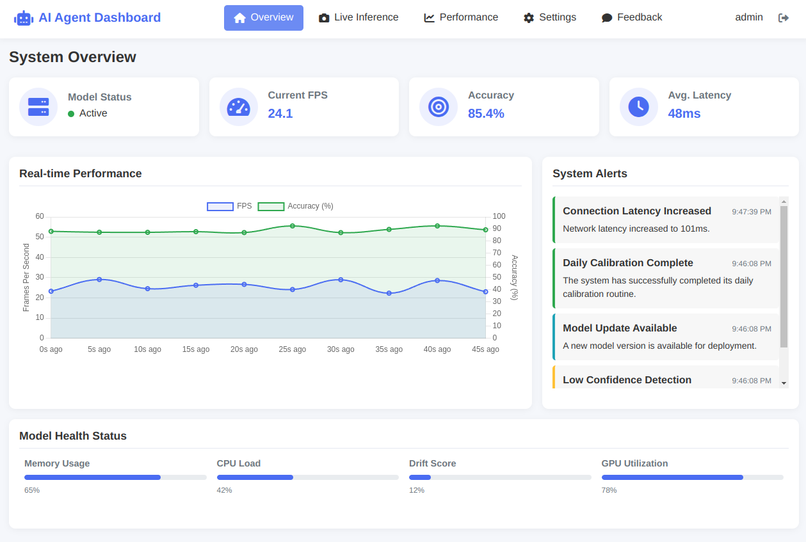

## The result from Claude-Code

### Snake Game

**Prompt:** Create a snake game with just html, css, and js.

## Phone Book Management System
**Prompt:** Create a simple Phonebook Management System using only HTML, CSS, and JavaScript, with a JSON file for data storage. The system should allow users to add, edit, delete, and search for contacts, storing information like name, phone number, and email. Contacts should be saved in a JSON file and loaded dynamically using JavaScript. The UI should be clean, responsive, and user-friendly, with a search bar for real-time filtering of contacts. Use localStorage as an alternative storage option for users who do not manually edit the JSON file. Implement form validation to ensure valid phone numbers and email formats. The design should be simple but visually appealing, with smooth animations for adding and deleting contacts.

## Easy CV System
Create a responsive, interactive dashboard for an AI-powered Agentic Tool using HTML, CSS, JavaScript, and libraries like Chart.js and Socket.io. The dashboard should include a login page for user authentication, a navigation bar with links to Overview, Live Inference, Performance, Settings, and Feedback sections. The Overview section should display the model's real-time status, key performance metrics like accuracy and FPS, and alert notifications. The Live Inference section should show a real-time video feed with inference results (bounding boxes, keypoints), along with control buttons for interaction. The Performance section should visualize data through dynamic charts showing model accuracy, FPS, and inference time, and display recent predictions in a table. The Settings section should allow users to adjust model parameters such as retraining intervals and alert thresholds. Finally, the Feedback section should enable users to provide feedback on predictions to help improve the model. The design should focus on a clean, minimalist aesthetic, with responsive layout and real-time updates for a seamless user experience. **MORE...**

