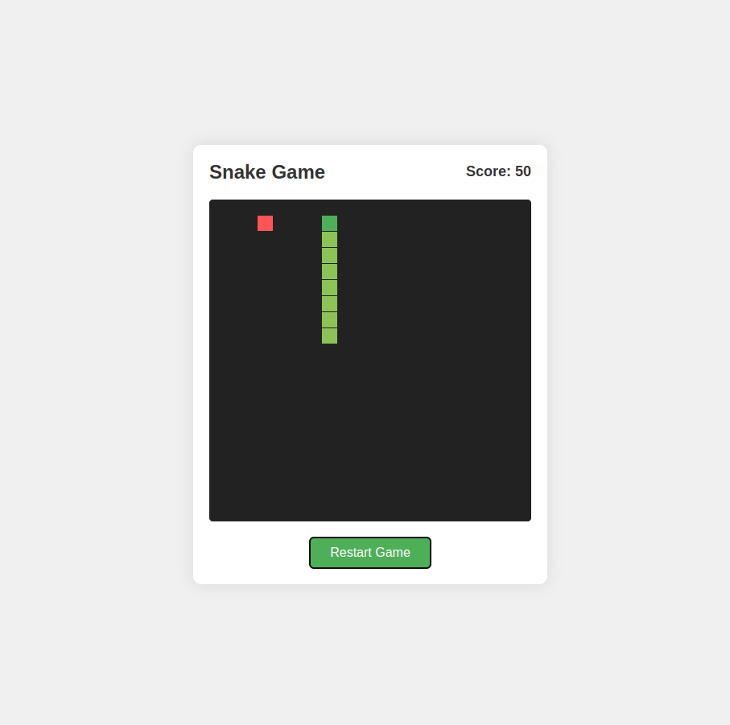

## The result from Claude-Code

### Snake Game

**Prompt:** Create a snake game with just html, css, and js.

## Phone Book Management System
**Prompt:** Create a simple Phonebook Management System using only HTML, CSS, and JavaScript, with a JSON file for data storage. The system should allow users to add, edit, delete, and search for contacts, storing information like name, phone number, and email. Contacts should be saved in a JSON file and loaded dynamically using JavaScript. The UI should be clean, responsive, and user-friendly, with a search bar for real-time filtering of contacts. Use localStorage as an alternative storage option for users who do not manually edit the JSON file. Implement form validation to ensure valid phone numbers and email formats. The design should be simple but visually appealing, with smooth animations for adding and deleting contacts.
